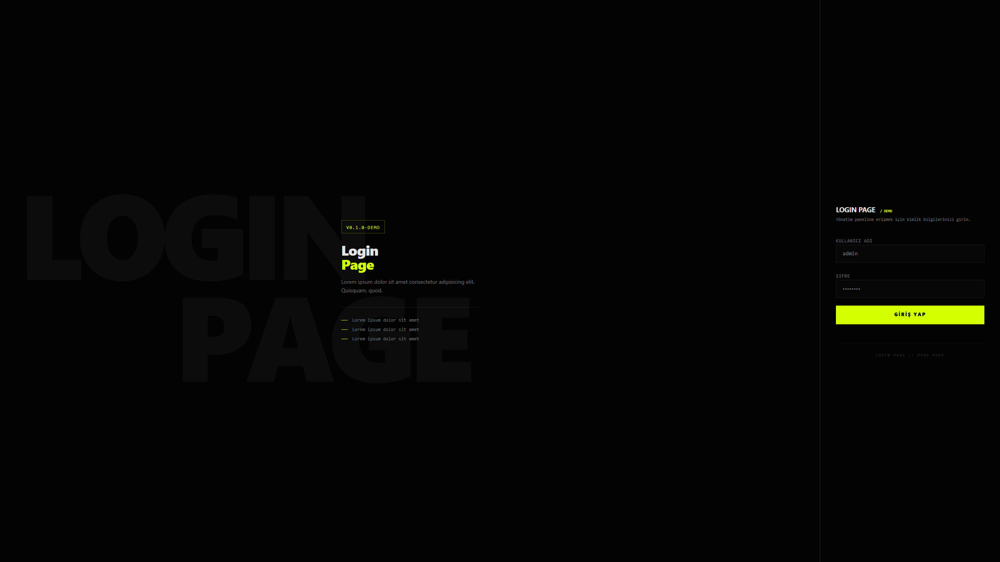

# 🔐 Login Page
<p align="center">
  
  
  
  
  
</p>

<p>
  Kişisel gelişim amacıyla tasarlanmış, modern ve karanlık estetikli bir giriş sayfası.
  <br />
  <strong>Ticari kullanım için izin verilmemektedir.</strong>
</p>

---
##  Özellikler

- **Modern Tasarım** — Acid Green (Asit Yeşili) detaylar ile güçlendirilmiş,karanlık mod estetiği
- **Dinamik Etkileşim** — `useTransition` ile yönetilen yükleme durumları ve pürüzsüz animasyonlar

---

## 📸 Ekran Görüntüsü

<p align="center">
  
</p>

---

## Teknolojiler

| Teknoloji | Versiyon | Açıklama |
|-----------|----------|----------|
| [React](https://react.dev/) | ^18 | UI kütüphanesi |
| [TypeScript](https://www.typescriptlang.org/) | ^5 | Tip güvenli JavaScript |
| [Vite](https://vitejs.dev/) | ^5 | Build tool & geliştirme sunucusu |
| [Tailwind CSS](https://tailwindcss.com/) | ^3 | Utility-first CSS framework |

---

## Kurulum

Projeyi yerel ortamınızda çalıştırmak için aşağıdaki adımları izleyin:


### Adımlar

1. **Repoyu klonlayın:**
   ```bash
   git clone https://github.com/kullanici-adi/login-page.git
   cd login-page
   ```

2. **Bağımlılıkları yükleyin:**
   ```bash
   npm install
   ```

3. **Geliştirme sunucusunu başlatın:**
   ```bash
   npm run dev
   ```

4. **Tarayıcınızda açın:**
   ```
   http://localhost:5173
   ```


##  Lisans

Bu proje yalnızca **kişisel ve eğitim amaçlı** kullanım için geliştirilmiştir.

- ✅ Kişisel kullanım
- ✅ Eğitim ve öğrenme amaçlı kullanım
- ❌ Ticari kullanım
- ❌ Yeniden dağıtım

---
